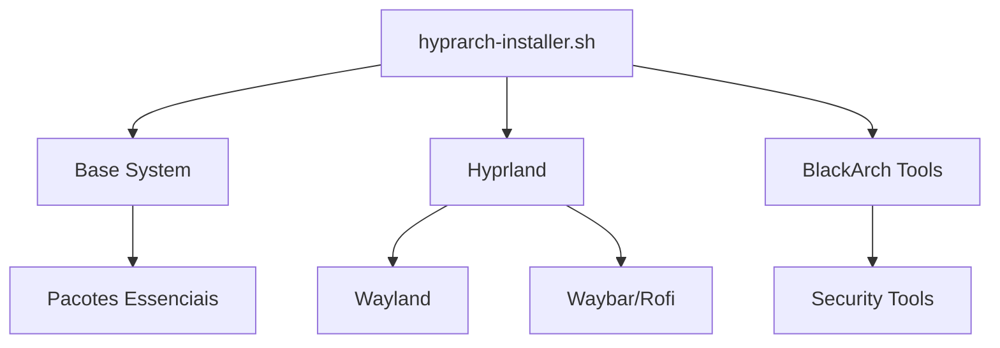

# Arquitetura do HyprArch Installer

## Visão Geral do Sistema
O HyprArch Installer é composto por:

1. **Script Principal** (`hyprarch-installer.sh`)
   - Fluxo de instalação sequencial
   - Funções modulares
   - Gerenciamento de dependências

2. **Subsistemas**:
   - Instalador do Arch Linux (base)
   - Configurador do Hyprland
   - Integrador do BlackArch
   - Sistema de logging

## Diagrama de Componentes


## Fluxo de Instalação
1. Pré-requisitos
   - Verificação de root
   - Conexão com internet
   - Partições configuradas

2. Instalação Principal
   ```text
   Base System → Hyprland → (Opcional) BlackArch → Configurações
   ```

3. Pós-instalação
   - Criação de usuário
   - Configuração do GRUB
   - Ativação de serviços

## Estrutura de Diretórios
- `/configs/` - Arquivos de configuração
- `/scripts/` - Scripts auxiliares
- `/themes/` - Temas pré-configurados
- `/backups/` - Sistema de backup

## Dependências Críticas
- `arch-install-scripts` (base)
- `git` (para temas)
- `curl` (downloads)