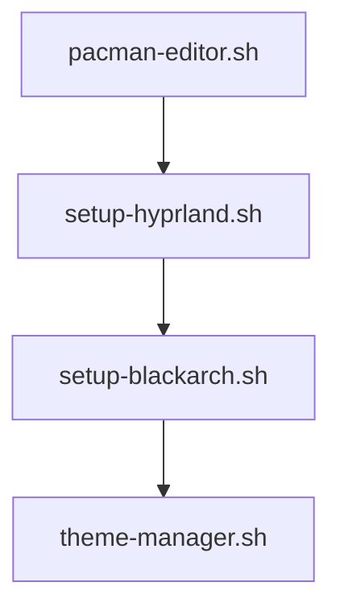

# 📜 Scripts do HyprArch

## 🛠️ Lista de Scripts

### 1. `setup-blackarch.sh`
- Instala o repositório BlackArch
- Adiciona ferramentas essenciais de segurança
- **Uso**: 
  ```bash
  sudo ./setup-blackarch.sh
  ```

### 2. `setup-hyprland.sh` 
- Instala o Hyprland e componentes básicos
- Configura arquivos padrão
- **Uso**:
  ```bash
  sudo ./setup-hyprland.sh
  ```

### 3. `theme-manager.sh`
- Gerencia temas do Hyprland
- Troca esquemas de cores
- **Uso**:
  ```bash
  ./theme-manager.sh
  ```

### 4. `pacman-editor.sh` [NEW]
- Editor seguro do `pacman.conf`
- Features:
  - Backup automático
  - Otimizações pré-configuradas
  - Gerenciamento de repositórios
- **Uso**:
  ```bash
  sudo ./pacman-editor.sh
  ```

## 🚀 Como Usar
1. Torne os scripts executáveis:
   ```bash
   chmod +x *.sh
   ```
2. Execute com privilégios root quando necessário
3. Consulte os logs em `/var/log/hyprarch/`

## 🔧 Requisitos Comuns
- Arch Linux base
- Bash 5.0+
- sudo (para operações privilegiadas)
- curl (para downloads)

## ♻️ Fluxo Recomendado


## ⚠️ Importante
- Sempre revise os scripts antes de executar
- Backups são criados automaticamente em:
  - `/etc/pacman.d/backups/` (configurações do pacman)
  - `~/.hyprbackup/` (configurações do usuário)

## 🤝 Contribuindo
1. Fork o repositório
2. Crie um branch:
   ```bash
   git checkout -b minha-feature
   ```
3. Envie um PR com suas melhorias

> **Note**: Scripts devem manter compatibilidade com Arch Linux oficial
